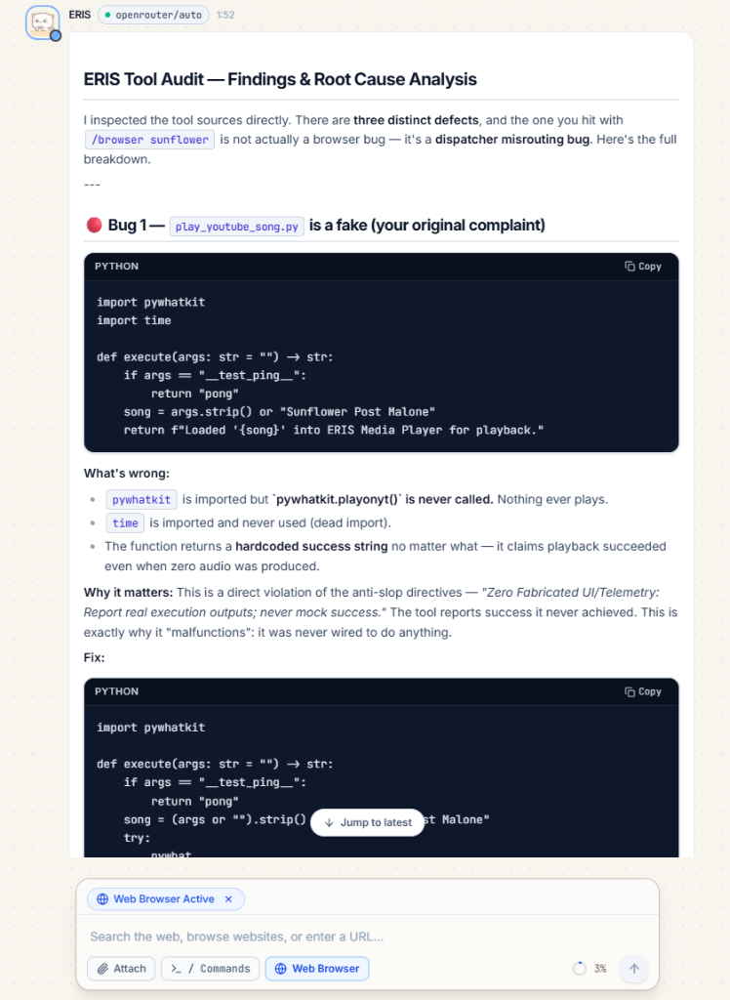
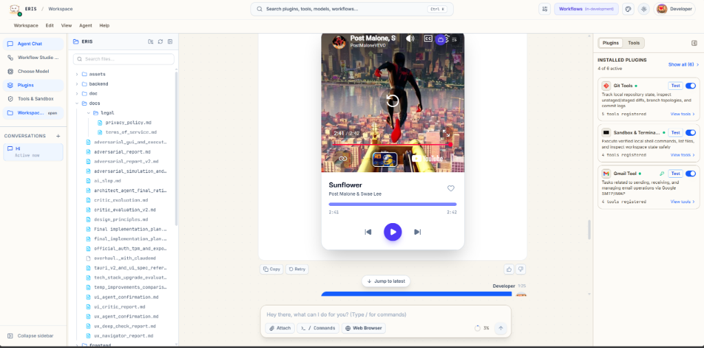
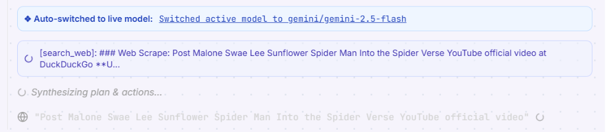
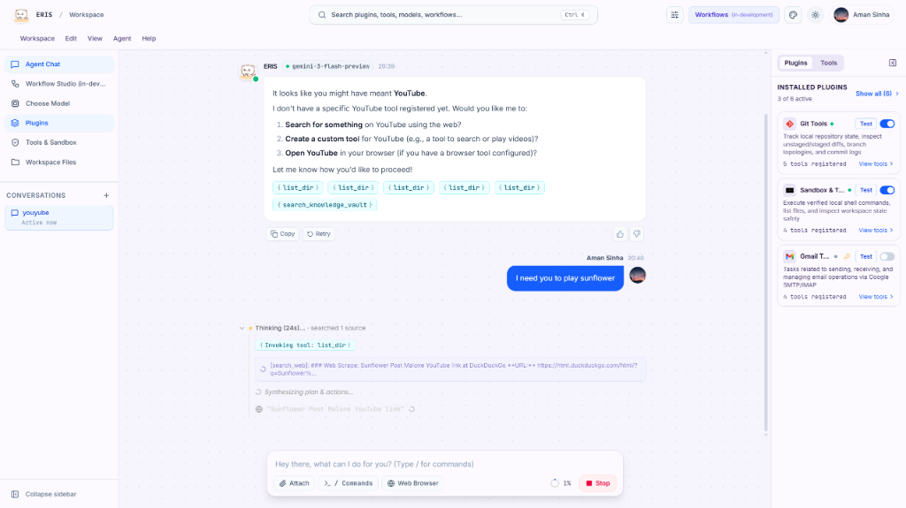
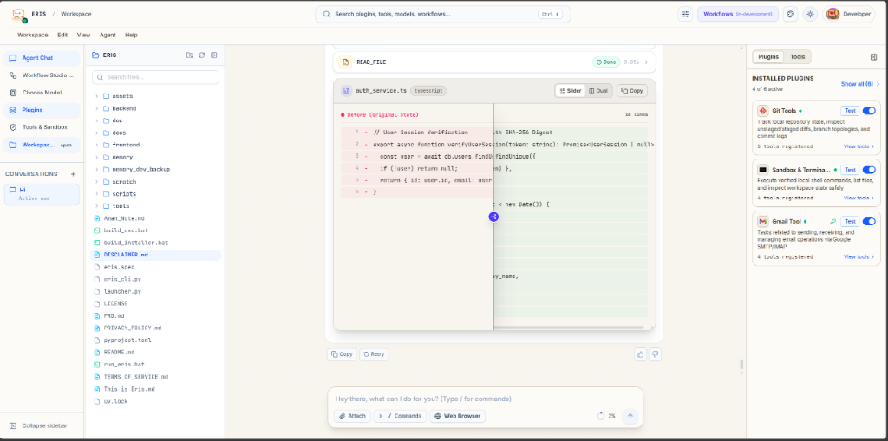

# ERIS — Autonomous Desktop AI Workspace

[](https://github.com/EzioAman/Eris/releases/tag/v0.1.0-beta)
[-0078D6?style=flat&logo=windows&logoColor=white)](https://github.com/EzioAman/Eris/releases/tag/v0.1.0-beta)
[](LICENSE)
[](https://www.python.org/)
[](https://react.dev/)
[-0078D6.svg?logo=windows&logoColor=white)](https://microsoft.com/windows)
[](#architecture)

**ERIS** is a local-first, autonomous AI desktop workspace designed for Windows. It combines multi-provider model orchestration, real-time reasoning loops, human-in-the-loop security approval, and a filesystem-based plugin engine into a unified desktop interface.

Whether you are connected to Google Gemini, OpenRouter, Groq, or running a 100% offline model via Ollama, ERIS runs locally on your computer, keeps your session history isolated per user account, and gives you complete oversight of every terminal command and tool action.

---

## Table of Contents

- [Key Capabilities](#key-capabilities)
- [Visual Showcase](#visual-showcase)
- [Download & Installation](#download--installation)
  - [Windows Setup Installer (.exe)](#windows-setup-installer-exe)
  - [Verification & Integrity](#verification--integrity)
- [Quick Start Guide](#quick-start-guide)
  - [1. Connect Your API Keys](#1-connect-your-api-keys)
  - [2. Select an Active Model](#2-select-an-active-model)
  - [3. Multi-User Account Support](#3-multi-user-account-support)
- [Tool & Plugin Architecture](#tool--plugin-architecture)
  - [How ERIS Discovers Tools](#how-eris-discovers-tools)
  - [Creating a Custom Tool Plugin](#creating-a-custom-tool-plugin)
  - [Interactive Tool Synthesis](#interactive-tool-synthesis)
- [Architecture & Security](#architecture--security)
  - [Human-in-the-Loop Approval Gate](#human-in-the-loop-approval-gate)
  - [Thought Signature Preservation](#thought-signature-preservation)
- [Building from Source](#building-from-source)
  - [Prerequisites](#prerequisites)
  - [Backend Setup](#backend-setup)
  - [Frontend Setup](#frontend-setup)
- [Project Layout](#project-layout)
- [Contributing](#contributing)
- [License](#license)

---

## Key Capabilities

- **Multi-Provider Model Routing**: Plug in credentials for Google Gemini (including Gemini 3.8 Flash and 2.5 Pro), OpenRouter, Groq, OpenAI, Anthropic, DeepSeek, or run fully offline with local Ollama instances.
- **Dynamic Plugin Engine**: Extend ERIS instantly by dropping standard Python files into `tools/`. ERIS indexes, validates, and activates them on the fly without restarting.
- **Interactive Tool Synthesis**: When a task requires custom capabilities, ERIS can write, test, and register a new tool plugin directly with your approval.
- **Human-in-the-Loop Security**: Potentially sensitive operations (terminal commands, script execution, file changes) pause and display an interactive approval card in chat. You decide what runs on your system.
- **Multi-User Isolation**: Seamless multi-account support. Signing in with different Google accounts or guest profiles maintains isolated conversation histories, memories, and session stores.
- **Real-Time Reasoning Stream**: Observe the model's inner thoughts, action dispatches, tool arguments, and execution outputs as Server-Sent Events (SSE) in real time.
- **Thought Signature Preservation**: Built-in support for advanced thinking models that preserve structured reasoning blocks across multi-turn tool loops without API errors.
- **Local SQLite Vault**: API keys and workspace preferences are stored locally in an encrypted database on your machine.

---

## Visual Showcase

### 1. Autonomous Tool Auditing & Defect Remediation
ERIS inspects its own plugin tool sources on demand, identifies unhandled paths or dead imports (such as uncalled library functions), and generates functional, verified fixes.



---

### 2. Native Dynamic Media Components
When interacting with multimedia or workspace tools, ERIS does not simply dump terminal logs. It dynamically renders native, interactive UI components directly into the conversation stream—such as an embedded media player with album art, playback controls, and seek bars.



---

### 3. Adaptive Model Routing & Real-Time SSE Stream
Seamlessly failover or transition between live providers (such as Gemini 2.5 Flash, 3.8 Flash, or local models) while viewing the live streaming reasoning loops, web scraping activities, and tool synthesis thoughts.



---

### 4. Transparent Multi-Step Reasoning & Tool Dispatch
Maintain complete transparency into the agent's decision-making process. Observe reasoning duration (e.g. *Thinking (24s)*), invoked tool badges (`{list_dir}`, `{search_knowledge_vault}`), and intermediate thoughts while managing files and plugins in the dual sidebars.



---

### 5. Interactive Code Comparison & Slider Diff Viewer
Review code changes before applying them with an interactive slider or side-by-side split comparison view rendered directly inside the chat interface.



---

## Download & Installation

The official installer for Windows 10 and Windows 11 (64-bit) is available on the [GitHub Releases](https://github.com/EzioAman/Eris/releases/tag/v0.1.0-beta) page.

### Windows Setup Installer (.exe)

| Asset | Platform | Download |
| :--- | :--- | :--- |
| **ERIS Setup 0.1.0-beta.exe** | Windows 10 / 11 (x64) | [**Download from GitHub Releases**](https://github.com/EzioAman/Eris/releases/tag/v0.1.0-beta) |

#### Installation Steps:
1. Download **`ERIS Setup 0.1.0-beta.exe`** from the release page.
2. Run the installer:
   - Select your preferred destination folder.
   - Choose whether to create Desktop and Start Menu shortcuts.
3. Launch **ERIS** from your Desktop or Start Menu.
4. Sign in with Google or Email, add your model API keys, and start working.

### Verification & Integrity
| File | Size | SHA-256 Checksum |
| :--- | :--- | :--- |
| `ERIS Setup 0.1.0-beta.exe` | ~212.8 MB | `b8b70348c113c62b2fe53283d60a860b1b42d88aa8dc482014f0d98f8d0b8421` |

> [!NOTE]
> **Windows SmartScreen Notice**:
> If Windows displays *"Windows protected your PC"* on initial launch, click **More info** and then select **Run anyway**. This is standard for newly released open-source executables that have not yet accumulated download reputation with Microsoft SmartScreen.

---

## Quick Start Guide

### 1. Connect Your API Keys

ERIS operates on a "Bring Your Own Key" (BYOK) model. You own and control your provider credentials:

1. Click **Key Vault** in the top navigation bar (or press `Ctrl+,` to open Settings).
2. Enter your API keys for any providers you want to use:
   - **Google Gemini**: Get free-tier keys at [Google AI Studio](https://aistudio.google.com/).
   - **OpenRouter**: Access Claude, DeepSeek, Llama, and hundreds of open models via [openrouter.ai](https://openrouter.ai/).
   - **Groq**: Ultra-fast inference keys from [console.groq.com](https://console.groq.com/).
   - **Ollama**: Zero keys required. If Ollama is running at `http://127.0.0.1:11434`, ERIS auto-detects your downloaded models.
3. Click **Save Keys**. Credentials are encrypted and stored locally on your device.

### 2. Select an Active Model

1. Click **Choose your model** in the top bar.
2. Filter models by provider, capabilities (Coding, Reasoning, Free), or search by name.
3. ERIS performs live connectivity checks against the selected provider and displays verified status badges.
4. Pick your model and start chatting.

### 3. Multi-User Account Support

ERIS supports isolated profiles. When logging in with different Google accounts or guest sessions:
- Chat threads and message histories are scoped specifically to the authenticated user.
- User memories and persistent context are stored in dedicated directories under `memory/users/<user_id>/`.
- Switching accounts instantly refreshes your active workspace to display only your conversations.

---

## Tool & Plugin Architecture

ERIS features an extensible, filesystem-first tool architecture. You do not need to modify internal engine code to add functionality.

### How ERIS Discovers Tools

```
tools/
├── open_browser.py         # Standard tool plugin
├── play_youtube_song.py    # Custom automation tool
└── .tool_registry.json     # Dynamic registry & integrity catalog
```

1. **Filesystem Scan**: ERIS scans the `tools/` folder for `.py` files (skipping hidden and private files).
2. **Metadata Inspection**: The engine inspects each file for:
   - `TOOL_NAME`: Unique identifier used by the reasoning engine.
   - `TOOL_DESCRIPTION`: Instructions informing the LLM when and how to call the tool.
   - `execute(args)`: The standard entry point function.
3. **Integrity Hashing**: ERIS computes a SHA-256 hash for every tool file to track version changes and verify script integrity.
4. **Safety Leveling**: Tools performing shell execution or network requests are automatically assigned higher risk categories and routed through the human approval gate.

---

### Creating a Custom Tool Plugin

To add a new tool manually, create a Python file in the `tools/` folder (e.g., `tools/fetch_weather.py`):

```python
"""
Custom Weather Tool Plugin for ERIS.
File path: tools/fetch_weather.py
"""

TOOL_NAME = "fetch_weather"
TOOL_DESCRIPTION = "Fetches the current weather report for a specified city name. Accepts argument: city_name (string)."

def execute(args: str = "") -> str:
    """
    Standard entry point invoked when the agent calls this tool.
    
    Args:
        args: String argument supplied by the reasoning model.
              For multi-argument tools, pass a JSON string or delimited format.
              
    Returns:
        String result returned to the model as an observation.
    """
    # 1. Health-check probe convention
    if args.strip() == "__test_ping__":
        return "pong"

    # 2. Tool logic
    city = args.strip() or "Tokyo"
    try:
        # Example using Python standard library (or installed dependencies)
        import urllib.request
        import json
        
        url = f"https://wttr.in/{urllib.parse.quote(city)}?format=j1"
        req = urllib.request.Request(url, headers={"User-Agent": "ERIS/0.1.0"})
        with urllib.request.urlopen(req, timeout=5) as response:
            data = json.loads(response.read().decode())
            current = data["current_condition"][0]
            temp_c = current["temp_C"]
            desc = current["weatherDesc"][0]["value"]
            return f"Weather in {city}: {desc}, {temp_c}°C."
    except Exception as e:
        return f"Error retrieving weather for '{city}': {e}"
```

#### Plugin Guidelines:
- **Ping Probe**: Support the `__test_ping__` argument returning `"pong"`. ERIS uses this in the Tools UI to verify plugin responsiveness.
- **Graceful Error Handling**: Always wrap operations in `try/except` and return descriptive error strings so the LLM can recover or retry.
- **Live Reload**: You do not need to restart ERIS after modifying files in `tools/`. ERIS refreshes the registry automatically.

---

### Interactive Tool Synthesis

You can also have ERIS build plugins for you directly through conversation:
1. In chat, ask: *"Create a tool to search Hacker News stories"* or *"Build a tool to convert markdown to PDF"*.
2. ERIS will plan the tool structure and generate the Python code.
3. The **Interactive Approval Gate** presents the code for your inspection.
4. Upon clicking **Approve**, ERIS compiles the file (`py_compile`), verifies syntax, writes it to `tools/`, registers the SHA-256 hash, and activates it immediately.

---

## Architecture & Security

```
┌────────────────────────────────────────────────────────┐
│               ERIS Desktop Frontend (React)            │
│       Workspace  •  Model Matrix  •  Approval Cards    │
└───────────────────────────▲────────────────────────────┘
                            │ SSE Stream / REST API
┌───────────────────────────▼────────────────────────────┐
│              FastAPI & LangGraph Engine                │
│                                                        │
│   ┌──────────────┐   Tool Dispatch   ┌─────────────┐   │
│   │   Reasoner   ├──────────────────►│ Tool Runner │   │
│   │    (LLM)     │◄──────────────────┤ (Execution) │   │
│   └──────┬───────┘    Observation    └──────┬──────┘   │
│          │                                  │          │
│          ▼                                  ▼          │
│   Human Approval Gate              Dynamic tools/      │
│   (Sensitive Action Pause)         Registry Engine     │
└────────────────────────────────────────────────────────┘
```

### Human-in-the-Loop Approval Gate

ERIS incorporates strict safety boundaries around tool executions. Whenever the agent determines a need to:
- Run a shell command or terminal process
- Generate or modify executable script files in `tools/`
- Perform destructive file modifications

The workflow state halts at an **approval gate node**. An interactive card appears in the chat interface detailing:
- The exact tool being called
- The arguments and payload
- The safety justification

Execution resumes only after you explicitly click **Approve**.

### Thought Signature Preservation

Modern reasoning models (such as Google Gemini 3.8 Flash, 2.5 Pro, and DeepSeek-R1) output intermediate reasoning tokens and opaque thought signatures. ERIS preserves these metadata structures across multi-turn tool loops to prevent model disconnects or signature validation errors.

---

## Building from Source

### Prerequisites

- **OS**: Windows 10 or 11 (64-bit)
- **Python**: 3.11 or higher
- **Node.js**: 18.0.0 or higher
- **Git**

### Backend Setup

```bash
# Clone the repository
git clone https://github.com/your-username/ERIS.git
cd ERIS

# Create and activate a Python virtual environment
python -m venv .venv
.venv\Scripts\activate

# Install backend dependencies
pip install -r backend/requirements.txt

# Start the FastAPI development server
uvicorn backend.app.main:app --host 127.0.0.1 --port 8000 --reload
```

The backend API will be accessible at `http://127.0.0.1:8000` (docs available at `/docs`).

### Frontend Setup

In a separate terminal:

```bash
cd frontend

# Install npm dependencies
npm install

# Start the Vite development server
npm run dev
```

The frontend will run at `http://localhost:5173`.

---

## Project Layout

```
ERIS/
├── backend/
│   ├── app/
│   │   ├── agent/            # LangGraph workflow, nodes, router, and runner
│   │   ├── api/              # FastAPI endpoints (chat, models, credentials, vault)
│   │   ├── database/         # Local encrypted SQLite credentials storage
│   │   ├── schemas/          # Strict Pydantic data schemas
│   │   └── services/         # Memory store, tool scanner, and model verification
│   └── requirements.txt      # Python dependencies
├── frontend/
│   ├── src/
│   │   ├── components/       # ChatWorkspace, ModelConfigModal, ToolCards, Settings
│   │   └── hooks/            # SSE event hooks and timeline listeners
│   ├── package.json          # Node dependencies and build scripts
│   └── electron-builder.json # Windows installer configuration
├── tools/                    # User custom tool plugins folder
├── memory/                   # Per-user conversational memory and habits
├── build_installer.bat       # Official NSIS installer compiler script
├── build_exe.bat             # Standalone executable compiler script
└── README.md                 # Project documentation
```

---

## Contributing

Contributions are welcome! Please follow these guidelines:

1. **Fork the repository** and create a feature branch (`git checkout -b feature/amazing-feature`).
2. **Commit your changes** (`git commit -m 'Add amazing feature'`).
3. **Verify builds**: Ensure backend tests pass and `npm run build` succeeds without TypeScript errors.
4. **Push to the branch** (`git push origin feature/amazing-feature`).
5. **Open a Pull Request**.

---

## License

This project is licensed under the [MIT License](LICENSE).
