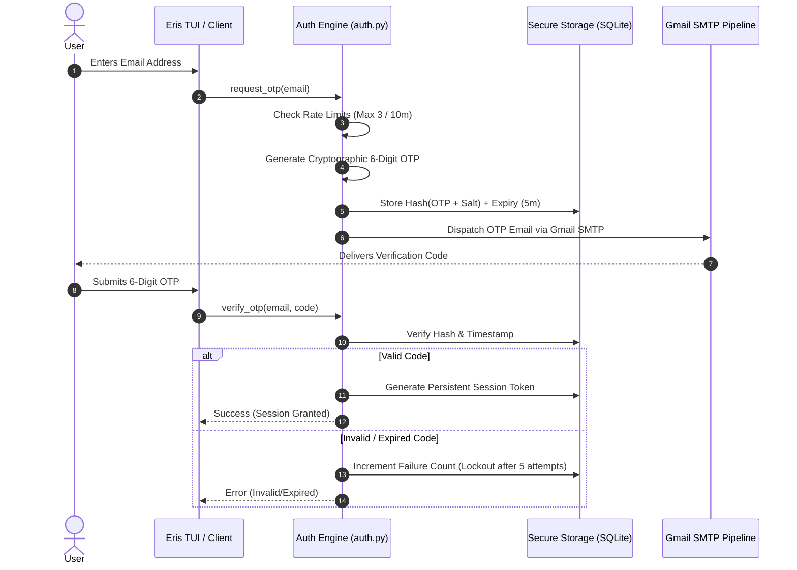

# Technical Specification: Email OTP Authentication Architecture

## 1. Overview
The ERIS OTP (One-Time Password) Authentication System provides cryptographic, email-based passwordless authentication. Users authenticate by requesting a time-limited numerical code delivered to their registered email via Eris's Gmail SMTP pipeline.

---

## 2. Architecture & Threat Model



---

## 3. Security Standards & Vulnerability Mitigation

| Attack Vector | Defense Mechanism | Implementation Detail |
|---|---|---|
| **Brute-Force Attack** | Attempt limits & lockout | Maximum 5 invalid attempts per email before the OTP is invalidated. |
| **Email Bombing / Spam** | Request throttling | Maximum 1 OTP request every 60 seconds per email; max 3 per 10 minutes. |
| **Code Leakage / DB Compromise** | Salted Hash Storage | Raw OTP codes are **never stored in plaintext**. Stored as `HMAC-SHA256(OTP, Secret_Salt)`. |
| **Timing Attacks** | Constant-time comparison | `hmac.compare_digest()` is used to verify hashes, preventing side-channel timing leaks. |
| **Replay Attacks** | Single-use consumption | An OTP record is immediately deleted/flagged as `consumed` upon successful verification. |
| **Code Expiration** | Strict TTL | Codes expire strictly after 5 minutes (300 seconds). |
| **Entropy & Predictability** | CSPRNG | Generated using Python's `secrets` module (`secrets.choice('0123456789')`), not pseudo-random `random.randint`. |

---

## 4. Database Schema (SQLite: `memory/auth.db`)

```sql
CREATE TABLE IF NOT EXISTS users (
    id TEXT PRIMARY KEY,
    email TEXT UNIQUE NOT NULL,
    created_at TIMESTAMP DEFAULT CURRENT_TIMESTAMP,
    last_login TIMESTAMP
);

CREATE TABLE IF NOT EXISTS otps (
    id INTEGER PRIMARY KEY AUTOINCREMENT,
    email TEXT NOT NULL,
    otp_hash TEXT NOT NULL,
    salt TEXT NOT NULL,
    created_at REAL NOT NULL,
    expires_at REAL NOT NULL,
    attempts INTEGER DEFAULT 0,
    is_consumed INTEGER DEFAULT 0
);

CREATE TABLE IF NOT EXISTS sessions (
    token TEXT PRIMARY KEY,
    user_id TEXT NOT NULL,
    email TEXT NOT NULL,
    created_at REAL NOT NULL,
    expires_at REAL NOT NULL,
    FOREIGN KEY(user_id) REFERENCES users(id)
);
```

---

## 5. Graceful Degradation & Resilience
- **Offline / Mock Mode**: In local development or testing environments where `SMTP_PASSWORD` is unavailable, the authentication engine logs a debug warning and can optionally output the code locally if configured in `DEBUG_MODE`.
- **Zero Heavy Dependencies**: Implemented using Python standard library (`sqlite3`, `secrets`, `hmac`, `hashlib`, `smtplib`, `time`) without introducing vulnerable or heavy unpinned packages.
