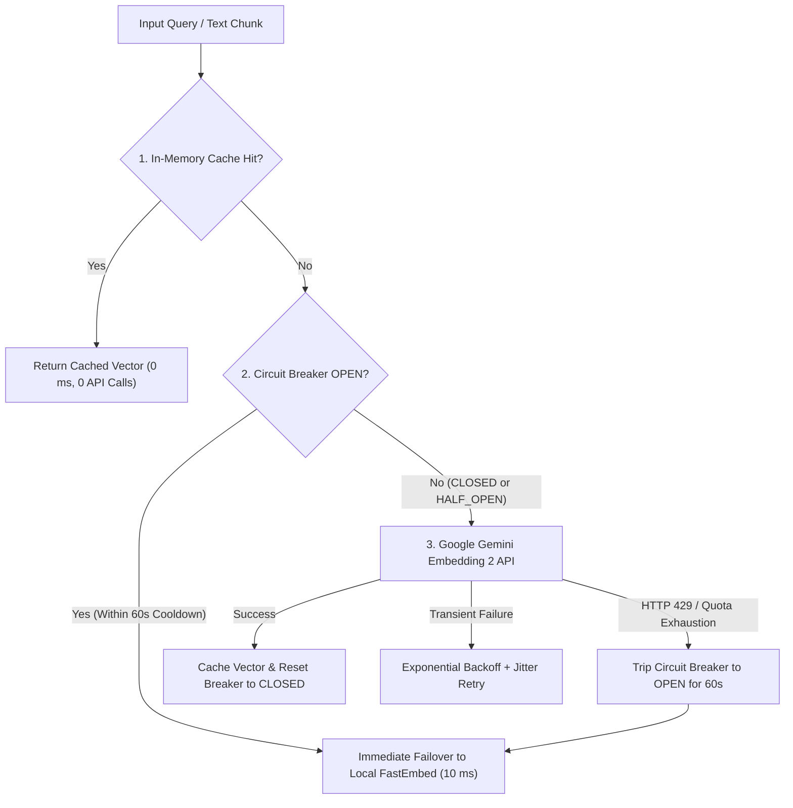

# Embedding API Exhaustion & Resilience Architecture

This document outlines industry best practices, architectural patterns, and implemented safeguards for handling rate limits (HTTP 429), quota exhaustion, and transient failures with embedding models (such as Google Gemini Embedding 2) in ERIS.

---

## 1. The Challenge: API Rate Limits & Quotas

Cloud-hosted embedding APIs (e.g., Google AI Studio `models/gemini-embedding-2`) enforce multi-tiered quota limits:
- **RPM (Requests Per Minute)**: Strict limit on how many embedding requests can be dispatched per 60-second window.
- **TPM (Tokens Per Minute)**: Volume limit on cumulative token length per minute.
- **RPD (Requests Per Day)**: Daily project ceiling for free or pay-as-you-go tiers.

When an application exceeds any of these thresholds, the API returns **HTTP 429 (ResourceExhausted)**. Without proactive resilience patterns, this causes:
1. Long blocking HTTP timeouts and network delays (1,000–3,000 ms per failed call).
2. "Thundering herd" retry storms that continuously reset quota cooldown windows.
3. System crashes or degraded assistant responsiveness during agentic reasoning cycles.

---

## 2. Multi-Layered Resilience Architecture

To eliminate latency bottlenecks and guarantee 100% uptime, ERIS implements a five-tier resilience pipeline:



### Layer 1: In-Memory / Hash-Based Query Cache
- **Mechanism**: Every text query or chunk is hashed using MD5.
- **Behavior**: If the hash exists in the cache, the 3072-dimensional vector is returned in `< 0.1 ms`.
- **Eviction**: Bounded FIFO/LRU cache capped at 512 entries to prevent memory bloat.
- **Impact**: Repeated searches or conversation evaluations burn **0 remote API tokens**.

### Layer 2: Circuit Breaker State Machine
- **States**:
  - `CLOSED`: Normal operations. Requests are sent to the primary cloud embedding API.
  - `OPEN`: Triggered immediately upon receiving `HTTP 429`, `ResourceExhausted`, or reaching `failure_threshold = 2`. All subsequent requests bypass the cloud network entirely for `cooldown_seconds = 60.0`.
  - `HALF_OPEN`: Once the 60-second cooldown expires, a single probe request tests API availability. If successful, the breaker resets to `CLOSED`. If it fails, the breaker trips back to `OPEN`.
- **Fail-Fast Benefit**: Prevents blocking user threads with repeated failing network round-trips.

### Layer 3: Exponential Backoff with Random Jitter
- **Formula**:
  $$\text{Wait} = \text{base\_delay} \times 2^{(\text{attempt} - 1)} + \text{uniform}(0.10, 0.25)$$
- **Purpose**: Applies exclusively to transient connection drops (e.g., DNS latency or 503 gateway drops), desynchronizing retries to avoid concurrent collision spikes.

### Layer 4: Resilient Local In-Process Fallback (`fastembed`)
- **Engine**: In-process ONNX runtime powered by `BAAI/bge-small-en-v1.5`.
- **Schema Conformity**: Vectors generated locally are zero-padded to 3072 dimensions to match the `pgvector(3072)` / SQLite vector schema seamlessly.
- **Guaranteed Continuity**: Even during complete internet outages or hard quota limits, agent reasoning and semantic search continue without interruption.

### Layer 5: Intent-Gated Tool & Knowledge Pre-Retrieval
- **Selective Execution**: Conversational greetings and small talk (`IntentType.CONVERSATION`) bypass RAG embedding calls entirely.
- **Tool Selection Gate**: If registered tools total $\le 15$, dynamic tool vector search is skipped, passing tools directly to the model. This eliminates up to 2,000 ms of redundant embedding calls per turn.

---

## 3. How to Test ERIS & View Telemetry

### 1. Running the Automated Test Suite
Run the comprehensive pytest suite verifying profile security, credential scrubbing, and multi-turn evals:
```bash
uv run pytest backend/tests -v
```

### 2. Live Conversation Benchmark with Per-Node Latency
Execute the multi-turn telemetry runner to measure TTFT, turn latency, and graph phase durations:
```bash
uv run python backend/app/evals/run_conversation.py
```
This script outputs:
- **TTFT (Time to First Token)**
- **Total Turn Latency**
- **Node Timings** (`reasoner`, `tool_runner`, `learning_recorder`)
- **Sub-Timings** (`rag_retrieval_ms`, `llm_completion_ms`)
- **Passphrase Recognition & Identity Verification**

### 3. Setting Up LangSmith Tracing
To inspect production traces and graph executions in the LangSmith dashboard:
1. Create a free account at [smith.langchain.com](https://smith.langchain.com/).
2. Generate an API Key under **Settings > API Keys** (format: `lsv2_pt_...`).
3. Add the following to your root `.env` file:
   ```env
   LANGCHAIN_TRACING_V2=true
   LANGCHAIN_ENDPOINT=https://api.smith.langchain.com
   LANGCHAIN_API_KEY=your_lsv2_key_here
   LANGCHAIN_PROJECT=eris
   ```
4. Run `uv run python backend/app/evals/run_conversation.py`.
5. Open [smith.langchain.com](https://smith.langchain.com/) and navigate to project **`eris`** to view step-by-step traces, token counts, and latency feedback scores.
