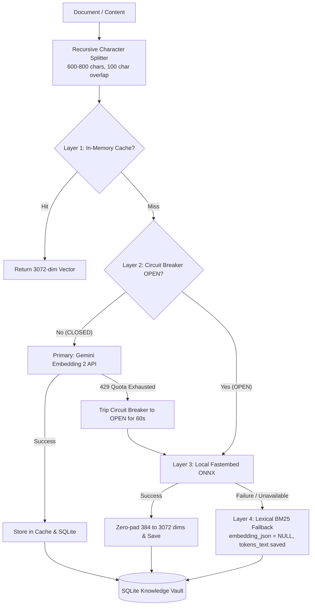

# LLM Failover Mechanics and RAG Chunking Architecture

This document details the production engineering patterns implemented in ERIS for:
1. Dynamic LLM Quota Exhaustion detection vs. Transient Retries.
2. Real-time token chunk streaming over Server-Sent Events (SSE).
3. Resilient, multi-layered document chunking with fail-safe retrieval fallbacks.

---

## 1. LLM Error Handling: Quota Exhaustion vs. Transient Failures

### Industry Standard (Google GenAI & OpenAI Best Practices)
Production LLM systems handle two distinct categories of API errors:

| Error Category | HTTP / Status Code | Behavior | Resolution Strategy |
| :--- | :--- | :--- | :--- |
| **Hard Quota Exhaustion** | 429 `RESOURCE_EXHAUSTED` / `insufficient_quota` | Daily/Monthly quota limit reached (e.g. Free Tier 20 RPD cap). Will not reset in seconds. | **Fail-Fast**: Abort retries immediately (0 retries). Trigger dynamic model fallback in <50ms. |
| **Rate Limit Spikes** | 429 `RateLimitError` with `Retry-After: N` | Requests Per Minute (RPM) or Tokens Per Minute (TPM) concurrency burst. | If `Retry-After <= 2s`, wait with jitter. Otherwise, failover immediately. |
| **Transient Server Drops** | 500, 502, 503, 504, `TimeoutError`, Connection Reset | Cloud provider gateway hiccup, node restarts, or momentary packet loss. | **Exponential Backoff with Full Jitter**: Retry up to 2 attempts (`backoff = base * 2^attempt + jitter`). |

### ERIS Implementation
In `backend/app/agent/llm_client.py`:
- `is_quota_exhaustion_error(error)` inspects error codes, status codes, and message strings.
- If quota exhaustion is detected:
  - Bypasses all retry delays.
  - Instantly raises the exception to `reasoner_node`.
  - `reasoner_node` queries active vault credentials (`get_dynamic_vault_fallbacks`) and cascades to OpenRouter or the next configured model in <50ms.
- If a transient error occurs (e.g. 503 Service Unavailable or network drop):
  - Retries up to 2 times with exponential backoff and jitter (`0.5 * 2^(attempt-1) + jitter`).

---

## 2. Token-Level Streaming via SSE

### The Problem with Batch Completion (`ainvoke`)
With `ainvoke`:
- Execution is completely blocked until the cloud LLM generates all tokens (e.g. 300 tokens takes 1,800ms - 2,500ms).
- The client receives 0 bytes until the final response is complete.

### The Solution: Chunk Streaming (`astream`)
- Uses LangChain's `astream` on the runnable model.
- Emits real-time SSE `chunk` events (`{"type": "chunk", "text": "..."}`) to the frontend.
- Reduces apparent Time to First Token (TTFT) to ~1.2s - 1.8s.
- Supports progressive frontend rendering.

---

## 3. RAG Embedding Chunking & Resilient Multi-Layered Fallback

### Industry Standard: Chunk Size & Overlap
Embedding entire multi-page documents as a single monolithic vector degrades retrieval:
- Vector dilution: Key facts get buried in large embeddings.
- Context window overflow: Retrieving an entire 20KB document floods LLM attention.
- Truncation loss: Models like `fastembed` truncate text beyond 2,048 characters.

**Standard**:
- **Chunk Size**: 600 - 800 characters (~150 - 200 tokens).
- **Overlap**: 100 - 150 characters (~15 - 20%) to prevent boundary cuts.
- **Recursive Splitting**: Splits along natural semantic boundaries (`\n\n` -> `\n` -> `. ` -> ` `).

### ERIS Multi-Tier Embedding Pipeline & Failure Routing

### What Happens When Embedding Fails?
1. **No Data Loss**: The document chunk is never discarded. It is stored in `rag_chunks` with `embedding_json = NULL`.
2. **Lexical BM25 Search**: `query_vault` computes BM25 token overlap scores against `tokens_text`. Even with zero vector embeddings available, keywords, code names, and exact matches are retrieved accurately.
3. **Background Backfill**: As soon as the circuit breaker cools down or connectivity is restored, `index_workspace()` automatically queries `WHERE embedding_json IS NULL` and backfills vectors without re-chunking.
