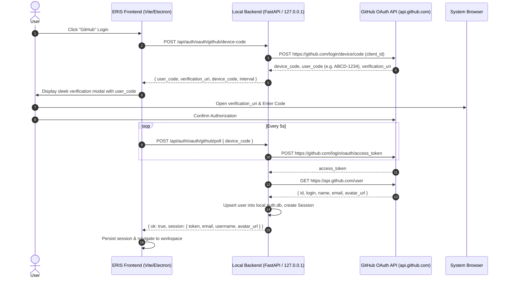
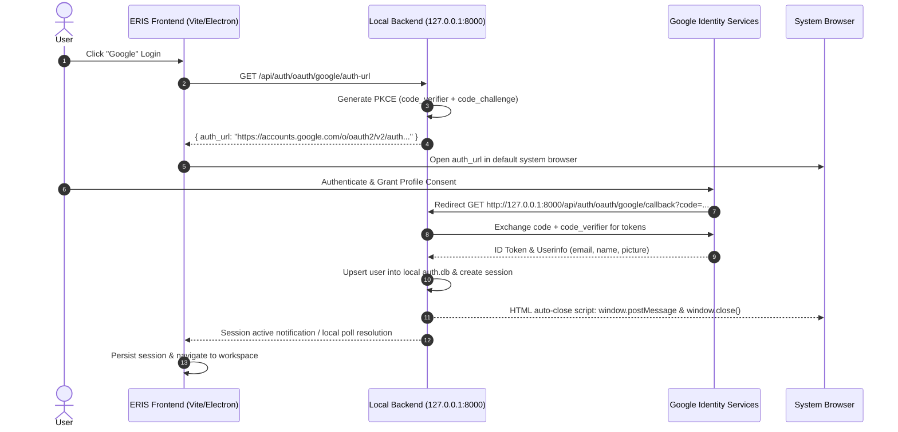

# ERIS Desktop OAuth Architecture: GitHub Device Flow & Google Native PKCE

## 1. Executive Summary
In compliance with local-first, zero-telemetry principles and open-source desktop best practices:
- **No User `.env` Configuration**: End users of desktop applications (e.g., VS Code, GitHub Desktop) should never be required to create or configure `.env` files.
- **Zero Client Secret Leakage**: Traditional OAuth 2.0 Web Server flows require exposing a `client_secret`, which is an anti-pattern in distributed open-source desktop apps.
- **Standards Used**:
  1. **GitHub**: [RFC 8628 OAuth 2.0 Device Authorization Grant](https://www.rfc-editor.org/rfc/rfc8628.html).
  2. **Google**: [RFC 8252 OAuth 2.0 for Native Apps](https://www.rfc-editor.org/rfc/rfc8252.html) using PKCE (RFC 7636) and local loopback redirection (`127.0.0.1`).

---

## 2. GitHub Device Flow (RFC 8628) Sequence

---

## 3. Google Native App Loopback Flow (RFC 8252) Sequence

---

## 4. Threat Model & Security Defenses
* **Token Storage**: OAuth access tokens are transiently used for profile initialization and discarded or encrypted in local AES-256 vault (`auth.db`). ERIS does not store long-lived cloud tokens unless user explicitly binds a GitHub git integration.
* **Local Session Isolation**: All user profiles, display names, and avatars remain stored strictly in the user's sovereign SQLite database on their local machine.
* **Zero Telemetry**: Authentication state is never routed through any developer-owned server.
