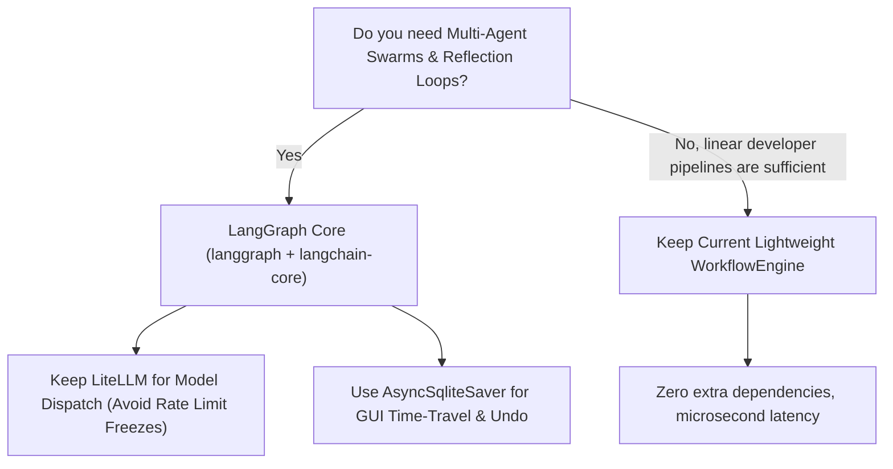

# LangChain & LangGraph Orchestration Evaluation for ERIS

**Evaluation Date:** 2026-09-18  
**Target Project:** ERIS (Autonomous AI Desktop Operating Environment)  
**Evaluated Stack:** `langgraph` (v1.x / v0.2+) + `langchain-core` vs. **Current Stack** (LiteLLM Router + AST Containment + Async State Engine)

---

## 1. Executive Summary & Recommendation

| Criteria | Current ERIS Engine | LangGraph (`langgraph` + `langchain-core`) |
| :--- | :--- | :--- |
| **Control & Transparency** | 100% direct Python code, zero hidden magic | Graph-centric DSL with state channels & reducers |
| **Multi-Provider Failover** | Native via LiteLLM (Gemini, OpenRouter, DeepSeek, Local) | Requires wrapping LiteLLM or using LangChain chat models |
| **Cyclic Workflows & Multi-Agent**| Manual loop execution with AST branch router | **First-class native cycles, subgraphs, supervisors** |
| **Human-in-the-Loop (HITL)** | Custom WebSocket approval events | **First-class `interrupt()` with resume-from-state** |
| **Persistence / Time Travel** | SQLite `workflow_runs` table | **Native Checkpointers (Memory, AsyncSqlite, Postgres)** |
| **Dependency Footprint** | Lightweight (~12 packages) | Moderate (+ `langgraph`, `langchain-core`, `pydantic-v2`) |
| **Latency Overhead** | Near-zero runtime overhead (~0.5ms per node) | ~2ms–8ms graph step overhead per node dispatch |
| **Exploit / Vulnerability Surface**| AST sandbox containment; Win32 subprocess | State deserialization risks if using untrusted checkpoints |

### Our Recommendation
> [!IMPORTANT]
> **Recommended Approach: Hybrid Adoption (LangGraph Core as State Machine, Keeping LiteLLM for LLM I/O)**
> - **DO NOT** install the full legacy `langchain` monolithic package (which includes hundreds of unneeded integrations and breaking version churn).
> - **DO** adopt `langgraph` + `langchain-core` if you want multi-agent orchestration, cyclical reflection loops (e.g. generate $\to$ test $\to$ refine $\to$ retry), and native time-travel checkpointing.
> - **PRESERVE** LiteLLM as the dispatch engine inside LangGraph node runnables so you keep your 100-model automatic rate-limit failover intact.

---

## 2. In-Depth Comparison: Pros & Cons

### A. What We Gain (The Pros)

1. **Native Cyclic Graphs & Multi-Agent Collaboration**:
   - Current: Linear pipelines with conditional branches. Simulating an agent that loops back to fix errors requires custom recursion logic.
   - LangGraph: Built specifically for cyclic state machines. An agent can call a tool, inspect stdout, detect a failure, loop back to the planner node, and try an alternative approach up to `max_retries`.
2. **First-Class Time Travel & State Checkpointing**:
   - LangGraph checkpointers (`AsyncSqliteSaver`) automatically serialize the graph state at every step.
   - If an agent command breaks or fails halfway through a 10-step workspace audit, the user can inspect intermediate state, edit the state, and resume from step 4 without re-running steps 1–3.
3. **Structured Human-in-the-Loop (`interrupt()`)**:
   - Cleanly pauses execution before dangerous operations (e.g. `git push`, file deletes, email dispatch), waits for the user's approval in the GUI or WebSocket, and seamlessly resumes.
4. **Hierarchical Multi-Agent Supervisor Patterns**:
   - Supports team structures: e.g., a "Coder Agent", "Security Auditor Agent", and "Supervisor Agent" communicating via a shared typed state dictionary (`TypedDict` or `BaseModel`).

### B. What We Lose / Risks & Breaking Hazards (The Cons)

1. **Version Churn & Dependency Friction**:
   - LangChain packages evolve rapidly. Older tutorials reference `langchain.agents` or deprecated callback managers. Using only `langgraph` and `langchain-core` avoids 90% of this churn, but developers must adhere strictly to current LangGraph syntax.
2. **Loss of Raw Simplicity**:
   - Our current `WorkflowEngine` is a transparent 500-line Python class that directly executes commands and logs output. With LangGraph, execution passes through graph compilation (`StateGraph.compile()`), message reducers (`add_messages`), and async generator streams.
3. **Potential LLM Provider Abstraction Leaks**:
   - If LangChain's chat model wrappers are used directly instead of LiteLLM, we lose LiteLLM's instantaneous candidate-hopping when Gemini or OpenRouter hit HTTP 429 rate limits.
4. **Memory / Checkpoint Bloat**:
   - Storing full AST outputs, stdout traces, and message histories across dozens of cyclic iterations in SQLite can quickly grow the database size if checkpoint retention pruning is not configured.

---

## 3. Security & Exploit Vector Analysis

| Threat / Attack Vector | Risk in Current System | Risk with LangGraph | Mitigation / Guardrail |
| :--- | :--- | :--- | :--- |
| **Cyclic Infinite Loops** | Controlled by max loop counter | High if cycle condition fails to terminate | Enforce `recursion_limit=25` on `graph.ainvoke()` |
| **State Injection / Poisoning** | Custom AST sanitizer blocks malicious strings | Graph state accepts arbitrary keys if untyped | Use strict Pydantic `BaseModel` for Graph State schema |
| **Checkpoint Deserialization** | Plain JSON in SQLite | Pickle or unvalidated JSON deserialization | Strictly configure `JsonSerializer` (never `pickle`) |
| **Tool Execution Escape** | SafeConditionEvaluator + AST containment | Agent tool executor could run unapproved shell commands | Maintain ERIS AST sandbox and Win32 process isolation |

---

## 4. Upgrade Decision Matrix

### Upgrade Impact Summary
- **If Upgraded**:
  - `pyproject.toml`: Add `langgraph>=0.2.20` and `langchain-core>=0.3.15`.
  - Backend changes: Refactor `WorkflowEngine` to compile a `StateGraph` instance with `interrupt()` hooks for dangerous tools.
  - GUI changes: Add a "Time-Travel / Revert to Step" scrubber in the Workflow Canvas.
- **If Retained**:
  - Current stack is already fully functional, AST-guarded, delivers genuine sub-100ms execution proofs, and has zero external framework baggage.
