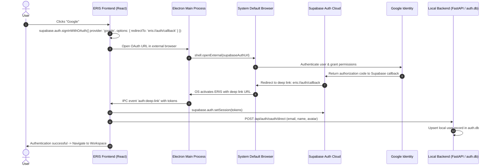

# Supabase Authentication Architecture for ERIS Desktop

## 1. Overview
This document specifies the integration of Supabase Authentication for Google OAuth into the ERIS Electron desktop application.

By using Supabase as the identity and auth provider:
- **Zero Secret Exposure**: The Google OAuth `client_secret` resides exclusively within Supabase's encrypted cloud vault.
- **Git Push Protection**: No secrets are stored in code or repository commits, preventing GitHub push rejections.
- **Public Desktop Compatibility**: Any user downloading ERIS can authenticate with Google without needing their own API keys or local `.env` files.
- **Local DB Synchronization**: Upon successful authentication, user identity is synced to the local SQLite database (`memory/auth.db`) to preserve local-first offline capabilities.

---

## 2. Authentication Flow

---

## 3. Required Configuration

### A. Google Cloud Console
1. OAuth 2.0 Client ID:
   - Type: **Web application** (for Supabase backend server-side exchange).
   - Authorized redirect URI: `https://<YOUR-PROJECT-REF>.supabase.co/auth/v1/callback`

### B. Supabase Dashboard
1. Go to **Authentication** -> **Providers** -> **Google**.
2. Enable Google.
3. Paste **Google Client ID** and **Google Client Secret**.
4. Go to **Authentication** -> **URL Configuration**.
5. Add `eris://auth/callback` to **Redirect URLs**.

### C. Client Environment
The public client requires only:
- `VITE_SUPABASE_URL`: e.g., `https://<project-ref>.supabase.co`
- `VITE_SUPABASE_ANON_KEY`: Safe public anon key (designed by Supabase for public client consumption with Row Level Security).
