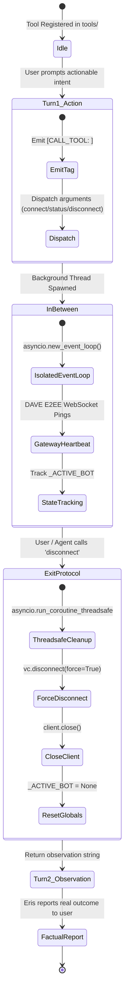

# Tool Execution Lifecycle & Exit Contract

## 1. The Core Defect: "Chatter Instead of Action"
When an LLM agent receives an actionable user request (such as *"disconnect from voice"*, *"check status"*, or *"inspect repo"*), without an explicit **Action Directive**, the model exhibits conversational procrastination:
1. **Turn 1**: Emits conversational promises (*"Oh! Let me take care of that right now, Aman! Give me a quick second..."*) without emitting a tool execution tag.
2. **Turn 2**: Requires manual user reprimand (*"do it"*).
3. **Turn 3**: Either hallucinates completion (*"Done and done!"*) or panics and executes destructive OS shell commands (such as `taskkill /f /im python.exe`) that terminate the runtime itself.

---

## 2. The 5-Point Tool Lifecycle Contract

Every autonomous tool in `tools/` and its definition in `prompt_builder.py` must strictly adhere to the **5-Point Lifecycle Contract**:

### Point 1: What the Tool Does
- Defines the concrete capabilities and supported argument syntax of the tool.
- Supports structured commands (e.g. `status`, `disconnect`, `<guild_id>|<channel_id>|<token>`).
- Provides deterministic validation ping (`__test_ping__` -> `"pong"`).

### Point 2: Why It Does It
- Provides sovereign, in-process, Python-native management of external subsystems (Discord Voice Gateway, APIs, databases).
- Replaces brittle, error-prone manual user configuration.
- Eliminates dangerous OS process-killing commands (`taskkill`, `Stop-Process`) that cause self-termination.

### Point 3: How It Handles the Task
- Enforces the **Turn 1 Mandatory Emission Directive**: The agent MUST emit `[CALL_TOOL: <tool> <args>]` in Turn 1.
- No conversational promises or stalling phrases are permitted.
- Resolves credentials dynamically from arguments or `.env` fallback (`DISCORD_BOT_TOKEN`, `DISCORD_GUILD_ID`, `DISCORD_CHANNEL_ID`).

### Point 4: What It Does in Between (Asynchronous State)
- Long-running tools must NEVER block the main CLI asyncio loop.
- Spawns a dedicated background daemon thread (`threading.Thread(daemon=True)`).
- Initializes an isolated `asyncio.new_event_loop()` dedicated to the background service.
- Maintains continuous Discord gateway heartbeat watchdogs.
- Caches the active instance in `_ACTIVE_BOT` and preserves module memory in `ErisCore.loaded_modules`.

### Point 5: How the Exit Works (Graceful Teardown)
- Controlled exit is triggered via `[CALL_TOOL: join_vc_server disconnect]`.
- Calls `asyncio.run_coroutine_threadsafe(_cleanup_bot(_ACTIVE_BOT), _ACTIVE_BOT.loop)` to schedule cleanup on the background loop where socket connections reside.
- Iterates over active `VoiceClient` objects and invokes `await vc.disconnect(force=True)`, transmitting Discord opcode 4 (Voice State Update) with `channel_id=None` so the bot leaves the channel immediately.
- Closes the Discord client and websocket connections via `await client.close()`.
- Shuts down the background loop and clears `_ACTIVE_BOT = None`.
- Returns a verified, factual observation (`SUCCESS: Disconnected Discord bot from voice channel and cleanly terminated session.`) so Eris can accurately report completion in Turn 2.

---

## 3. Canonical Reference: `tools/join_vc_server.py`

| Lifecycle Phase | Implementation Component | Contract Verification |
| :--- | :--- | :--- |
| **What** | `execute(args)` with `status`, `disconnect`, `<guild_id>...` | Validated via `__test_ping__` and AST audit |
| **Why** | In-process Discord voice client with DAVE E2EE protocol | Replaces `taskkill` and manual bots |
| **How** | Direct tag emission in Turn 1 (`[CALL_TOOL: join_vc_server <args>]`) | System prompt Section 5b directive |
| **In Between** | Isolated `threading.Thread` + dedicated `asyncio.new_event_loop()` | Gateway heartbeat never blocks CLI `Prompt.ask` |
| **Exit** | `asyncio.run_coroutine_threadsafe(_cleanup_bot, loop)` | Force disconnects voice client, closes gateway, resets state |

---

## 4. AST Guardrail & False-Positive Prevention
In `eris_cli.py`, `check_harmful_code` was enhanced to inspect AST `Call` nodes (e.g. `subprocess.run`, `os.system`) rather than doing raw regex matches on whole-file text strings. This ensures that docstrings and comments explaining *"Never use taskkill"* are not falsely flagged as malicious command executions.
