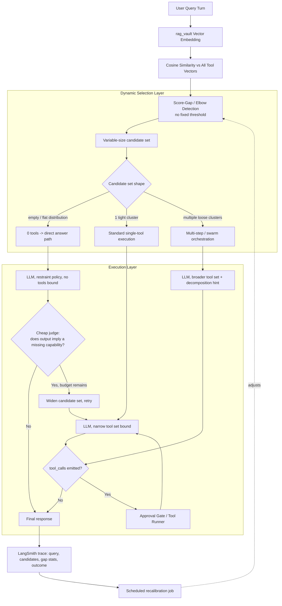

# Architectural Implementation Plan v2: Fully Dynamic Semantic Tool Selection

## 1. What "dynamic" replaces, item by item

| Static (v1) | Dynamic (v2) |
|---|---|
| Fixed similarity threshold `0.38` | Per-query **score-gap detection** — no absolute cutoff, just "where does the distribution break" |
| Fixed `top_k=6` | Elbow-derived candidate count, different every query |
| Hand-written negative boundaries, frozen at write time | Same boundaries, but **auto-augmented** from failure traces (recurring false-positive queries get appended as explicit exclusions) |
| Keyword list deciding "Swarm vs Standard" orchestration | Orchestration depth derived from the **shape of the retrieved candidate set** (spread/diversity of matched tools) |
| No recovery if the right tool didn't clear threshold | Closed-loop **widen-and-retry** triggered by a cheap judge model, bounded so it can't loop forever |
| Threshold picked once, never revisited | **Rolling recalibration** against real LangSmith outcome data, on a schedule |

A note on the phrase "fully dynamic": it doesn't mean zero constants — it means the constants are statistically derived and self-correcting instead of guessed. A system with truly nothing fixed has no way to make a first decision on day one before any data exists (the cold-start problem), so this plan keeps one principled default and makes everything else adapt around it.

---

## 2. Target Architecture



---

## 3. Phase 1 — Score-Gap Detection (replaces fixed threshold)

**Target file**: `backend/app/agent/registry.py`

The core idea: don't ask "is this score above 0.38", ask "where's the biggest relative drop in the sorted score list for *this specific query*." A gap-based cutoff self-adjusts to query length, embedding scale drift, and tool-count growth — a fixed cosine cutoff does none of that.

```python
def get_relevant_tools(self, query: str = "", max_k: int = 12) -> List[StructuredTool]:
    if not query or not query.strip():
        return []

    query_vec = rag_vault.generate_embedding(query.strip())
    if not query_vec:
        return self.get_baseline_tools()

    scored = sorted(
        ((cosine_similarity(query_vec, vec), name) for name, vec in self._tool_embedding_cache.items()),
        reverse=True
    )
    scores = [s for s, _ in scored]

    # Cold-start backstop: below this, nothing has ever looked "relevant" to anything.
    # This is the one constant we keep, and it's a floor, not a decision threshold.
    if scores[0] < self._min_plausible_relevance:  # seeded low, tightened by recalibration
        return []

    cut = self._find_elbow(scores[:max_k])   # index where the biggest relative drop occurs
    relevant = [name for _, name in scored[:cut]]

    self._log_selection_trace(query, scores[:max_k], cut)  # feeds recalibration job
    return [self._langchain_tools[name] for name in relevant]

def _find_elbow(self, scores: List[float]) -> int:
    """Return the index of the largest relative drop in a sorted-descending score list.
    A query with one clearly-best tool produces a sharp single drop; a query with no
    relevant tool produces a flat, noisy list with no meaningful drop -> returns 0."""
    if len(scores) < 2:
        return len(scores)
    drops = [(scores[i] - scores[i + 1]) / (scores[i] + 1e-6) for i in range(len(scores) - 1)]
    max_drop_idx = max(range(len(drops)), key=lambda i: drops[i])
    # Require the drop to be meaningfully larger than the average drop in the list,
    # or treat the whole list as noise (no tool stands out).
    if drops[max_drop_idx] < self._noise_floor * (sum(drops) / len(drops)):
        return 0
    return max_drop_idx + 1
```

`_min_plausible_relevance` and `_noise_floor` are the only two numbers left in the system, and neither is a decision threshold hand-tuned from vibes — both are seeded conservatively and then owned by Phase 5's recalibration job. That's the honest version of "no magic numbers": you don't eliminate constants, you stop hand-picking them and let outcome data pick them for you.

---

## 4. Phase 2 — Negative-Boundary Schemas, Now Self-Augmenting

Keep the dual-boundary table from v1 (positive trigger / explicit negative boundary) as the seed. What's new: false-positive tool calls surfaced from LangSmith traces get turned into additional negative-boundary clauses automatically, not by someone remembering to edit a docstring.

```python
class ToolBoundaryAugmenter:
    """Runs on a schedule. Pulls traces where a tool was called but its output was
    unused/discarded by the model or corrected by the user, clusters the query text
    of repeat offenders, and appends a generated exclusion clause to that tool's
    description — with a human diff/approval step before it's written to disk."""

    def propose_boundary_updates(self, tool_name: str, window_days: int = 14) -> Optional[str]:
        false_positives = self.langsmith_client.query_traces(
            tool_name=tool_name, outcome="unused_or_corrected", window_days=window_days
        )
        if len(false_positives) < self.min_cluster_size:
            return None
        cluster_summary = self.summarize_query_cluster([t.query for t in false_positives])
        return f"Do NOT use for: {cluster_summary}"
```

This is the dynamic analog of the hand-written table — the table still exists as the starting point (you can't bootstrap boundaries from zero traces), but it stops being static once real usage data exists.

---

## 5. Phase 3 — Orchestration Depth from Candidate Shape, Not Keywords

Replace the "Swarm vs Standard" keyword classifier with a read of the candidate set's own geometry — this is genuinely query-derived rather than looked up from a word list:

```python
def infer_orchestration_depth(candidates: List[Tuple[float, str]]) -> Literal["direct", "standard", "swarm"]:
    if not candidates:
        return "direct"
    if len(candidates) == 1:
        return "standard"
    # Multiple candidates with low pairwise similarity to EACH OTHER (not just to the
    # query) implies the task spans distinct capability areas -> needs decomposition.
    pairwise = [cosine_similarity(tool_vec[a], tool_vec[b])
                for a, b in itertools.combinations([n for _, n in candidates], 2)]
    return "swarm" if statistics.mean(pairwise) < self._diversity_floor else "standard"
```

A query needing `read_file` + `run_command` together (tightly related, same task) stays "standard." A query needing `search_knowledge_vault` + `send_email` + `create_custom_tool` (semantically unrelated capabilities) signals a multi-step task and routes to swarm/decomposition prompting — derived from the actual retrieved set, not predicted in advance by a word list.

---

## 6. Phase 4 — Recovery Loop for Under-Retrieval

This directly answers the biggest failure mode of a purely retrieval-gated design: what happens when the right tool doesn't clear the gap detector. Instead of a text-regex heuristic ("contains 'I don't have access'"), use a cheap judge call — cheap because it only fires when zero tools were bound, so it costs nothing on the (common) path where retrieval already worked:

```python
def maybe_recover(state):
    if state["tools_bound"]:  # retrieval already found something — no judge needed
        return state
    verdict = judge_llm.invoke([
        SystemMessage(content="Did the assistant's reply indicate it lacks a capability "
                               "or data source it would need to fully answer? Answer only yes/no."),
        HumanMessage(content=state["last_response"].content)
    ])
    if verdict.strip().lower() == "yes" and state["widen_attempts"] < self._max_widen_attempts:
        return {**state, "max_k": state["max_k"] * 2, "widen_attempts": state["widen_attempts"] + 1}
    return state
```

`_max_widen_attempts` bounds this so a genuinely tool-less query (there's no tool for this, and there never will be) doesn't loop forever re-querying with an ever-widening candidate pool — it degrades gracefully to "answer as best you can" after N tries.

---

## 7. Phase 5 — Scheduled Recalibration

Everything above adapts *per query*. This phase is what adapts the *system* over weeks:

- Nightly/weekly job pulls LangSmith traces: `(query, candidates_shown, gap_index_chosen, tool_called, was_tool_useful)`.
- Fits a simple calibration model — logistic regression or isotonic regression is enough, no need for anything heavier — mapping `(top_score, gap_size, candidate_count)` → `P(tool_was_actually_needed)`.
- Uses that fit to adjust `_min_plausible_relevance` and `_noise_floor`, not by hand, but as the threshold that maximizes precision/recall on the accumulated trace data.
- Writes the new values with a version stamp and a rollback path — recalibration should never auto-deploy without a guard, since a bad week of traces (e.g., a UI bug that mislabels outcomes) shouldn't silently degrade the whole retrieval layer.

---

## 8. Verification & Test Plan

1. **Elbow-detection unit tests**: synthetic score distributions (flat/noisy, one clear winner, two clusters) — verify `_find_elbow` returns the expected cut point, not verify against a fixed 0.38.
2. **Recovery-loop bound test**: confirm a genuinely toolless query terminates within `_max_widen_attempts` and doesn't infinite-loop.
3. **Recalibration regression test**: feed a frozen historical trace set through the calibration job, assert the fitted thresholds land within an expected band — catches the calibration job itself drifting badly on bad data.
4. **Shadow-mode rollout**: before v2 makes live tool-binding decisions, run it alongside v1 for a window, logging what it *would* have chosen, and diff against v1's fixed-threshold decisions — this is your actual evidence for whether dynamic beats static before you cut over.

---

## 9. Risk Analysis (v2-specific)

| Risk | Mitigation |
|---|---|
| Cold start: no traces yet, calibration has nothing to learn from | Seed `_min_plausible_relevance`/`_noise_floor` conservatively (favor false negatives over false positives initially), run shadow-mode until trace volume is sufficient |
| Recalibration overfits to a noisy/short window | Require minimum trace count before recalibration is allowed to move thresholds; smooth via exponential moving average across recalibration cycles rather than replacing outright |
| Judge-model recovery loop adds latency on the failure path | Only invoked when zero tools were bound (rare path), and only a small/fast model — cost is bounded to the cases that were already failing anyway |
| Boundary auto-augmentation writes bad exclusion text from a bad cluster | Human-approval diff step before any generated boundary clause is committed, same as the existing tool-synthesis approval gate |
